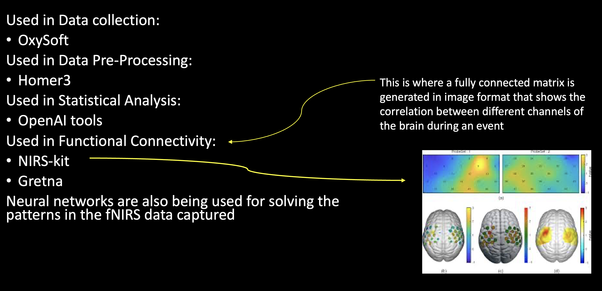

# MultiheadedTransformer

  
In this experimental paradigm, subjects interacted with a humanoid robot. The protocol includes the following events: a resting state (used as baseline), informal interaction with the robot, and segments where the robot tells two different stories. Each story is designed to incorporate key emotional milestones such as moments of excitement, surprise, or contemplation by embedding specific narrative triggers. These milestones are hypothesized to induce distinct patterns of neural activation and changes in functional connectivity among cortical regions.

We leveraged the [fNIRS-T model](https://ieeexplore.ieee.org/document/9670659) to classify whether a subject is listening to Story 1 or Story 2. The model is modified for binary classification in this context, while still retaining its dual-perspective architecture. The spatial level transformer processes “patch” embeddings derived from the 2D fNIRS activation maps (which depicts the collective behavior across channels), capturing the global pattern of brain activity. Simultaneously, the channel-level transformer focuses on the individual time series data from each channel, thereby preserving the nuances of the hemodynamic responses.
Dataset consists of fNIRS signals pre-processed using Homer3, where data from 24 channels are organized into subject-event pairs. Each sample represents a subject's brain response during a specific event, with the signals capturing both oxygenated (HbO) and deoxygenated (HbR) haemoglobin concentrations.
By applying the fNIRS-T model to this subject robot interaction paradigm, the aim is to achieve high classification performance in distinguishing between story types, while also providing insights into the dynamic neural responses evoked by different narrations.

